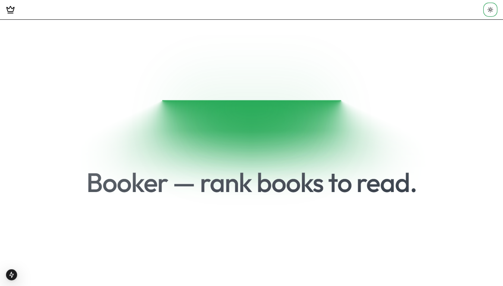

# Booker App

Booker allows you to collect books to read. You can prioritize books by rating them. And with a simple sort button, you can sort books by rating. The ones with the highest ratings are at the top.



## Getting Started

You need to have Bun installed.

```bash
bun install
```

To run the app, run the following command:

```bash
bun dev
```

This will start the Next.js development server. Open your browser and navigate to http://localhost:3000/.

## Learn More

To learn more about Next.js, take a look at the following resources:

- [Next.js Documentation](https://nextjs.org/docs) - learn about Next.js features and API.
- [Bun](https://bun.sh/) - learn about Bun.
